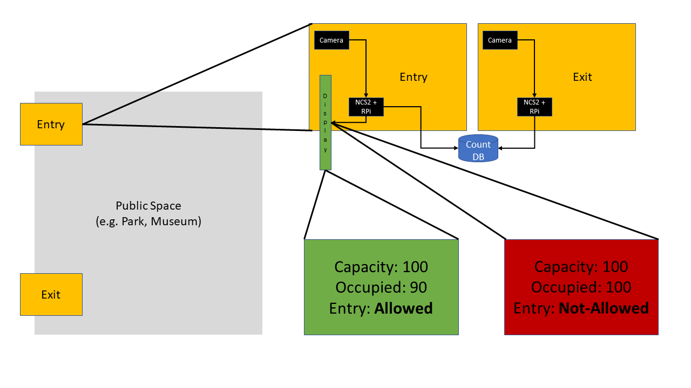

# OpenVinoRaspberryPi-PublicLimits
Simple project using Intel® Distribution of OpenVINO™ toolkit, Raspberry Pi, and Intel Neural Compute Stick 2 as well as a pair of camera, for counting the number of people in a public space to allow new entries. This allows for easy enforcement of social distancing guidelines withing public spaces. 

## Requirements

* Camera - 2
* Raspberry Pi - 2
* Intel Neural Compute Stick 2 - 2
* Either ethernet connection between 2 raspberry pie or cloud connection between raspberry pi and a cloud database

## Steps: 

* Install two cameras on the entry and exit of a public space
* Run YOLO object detection to detect a person entering the public space
* Increase the counter database with number of person detected entering
* Run YOLO object detection to detect a person exiting the public space
* Decrease the counter database with number of person detected exiting
* Based on the capacity of the public space and people already inside the public space we can limit entry.

## Privacy and ethics:

* Person detection algorithms may be biased towards people with different looks. This should be fixed before deploying. 
* No detected person image should be stored in the database to respect the privacy of the individuals using a public space. Code should be public and audited that these requirement is met before deployment. 

## Contributor

Shubhanshu Mishra - [https://shubhanshu.com/](https://shubhanshu.com/)
